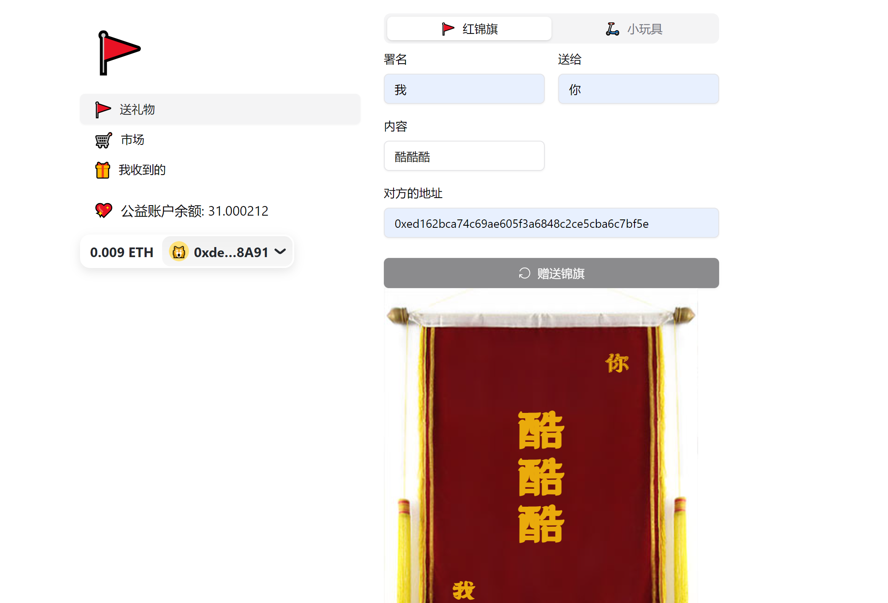
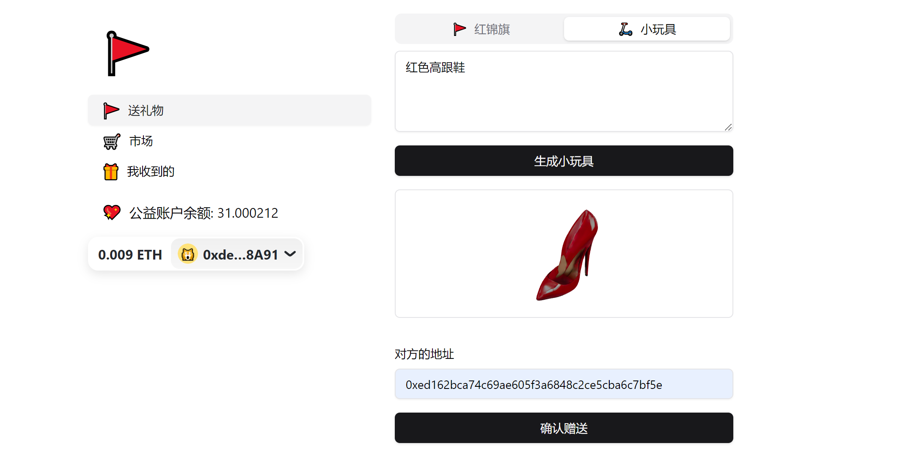
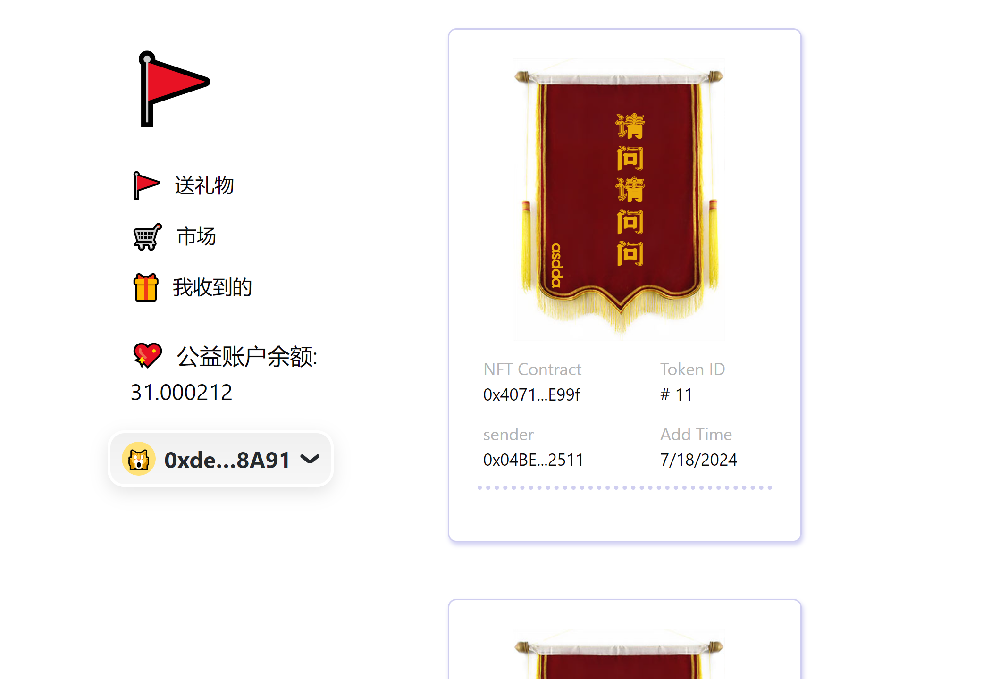
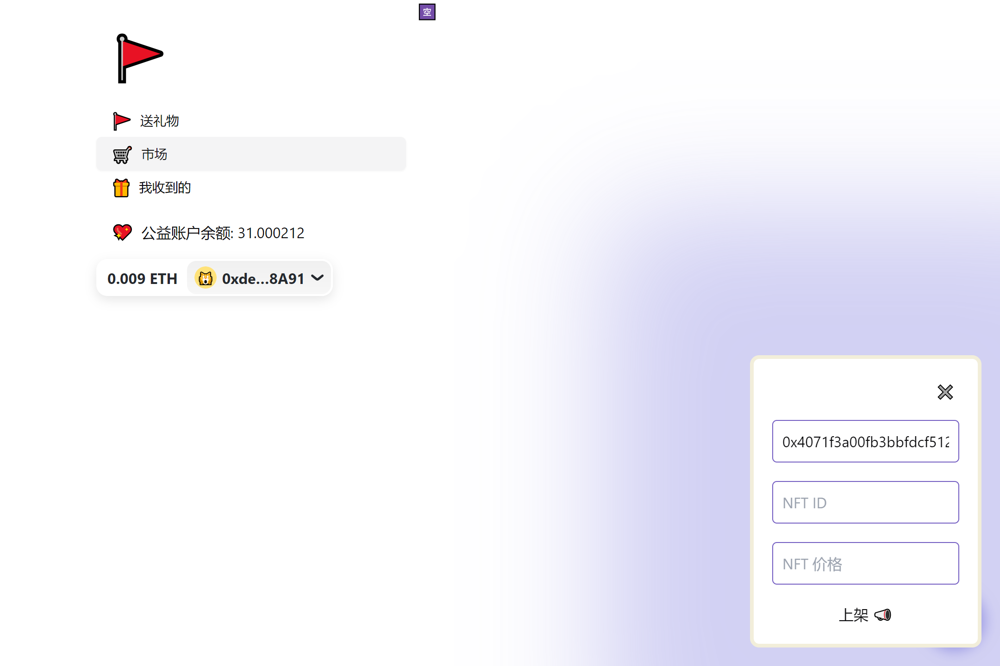
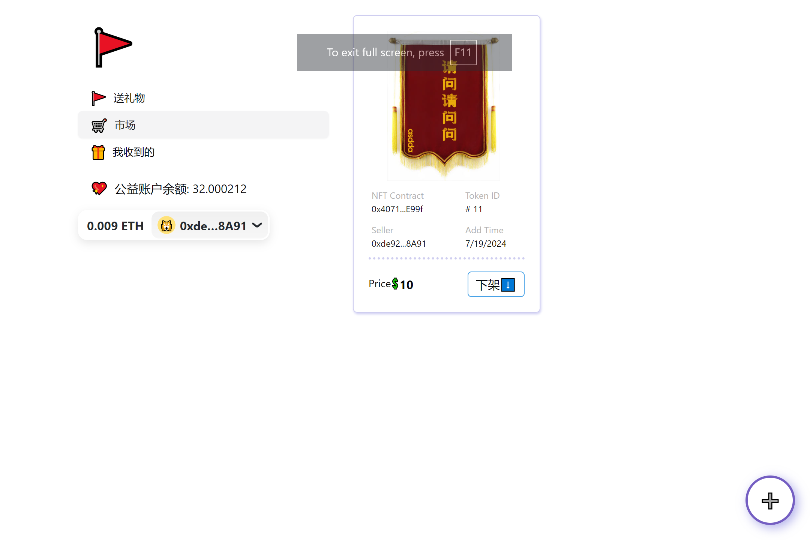

# NFT 锦旗公益平台
给你感谢的医生或朋友送一个 NFT 锦旗礼物，同时给公益账户捐赠一些金额！

## 介绍
锦旗 NFT 礼物公益市场是一个基于区块链技术的公益平台，使用 Solidity + Remix, 由两个 web2 前端极限现学 web3 现卖。 除了生成锦旗，也可以通过 AI 生成一些其他的虚拟小礼物。用户可以通过平台向医护人员、教师、志愿者等社会贡献者赠送数字锦旗，并将购买锦旗的费用直接捐赠至公益账户，用于帮助需要医疗救助的人们。整个过程透明公开，确保捐赠资金的流向清晰可查。通过数字锦旗（NFT）的交易和传播，推动社会公益事业的发展。

### 优势
1. 区块链交易是完全透明的。公共账户有多少收益款，人人可查看。支出到了哪里，也人人可查看。解决公益不透明的问题。
2. NFT mint 之后，在链上就永远存在，有它自己的 ID，并且交易记录可追溯。医生可以在需要的地方展示或交易写有他名字的 NFT，永远存在链上。解决物理锦旗的浪费等问题，同时提高交易性，计入公益支出。
3. 锦旗文化，是华语圈的独特文化。带有纪念/感恩/表彰等积极含义。

## 功能
- 授予。用户可以手动输入[TODO: 或接入 AI 智能提示文案]，前端生成带文案、授予人名字等信息 的 image 图片[可以扩展主题，主题可以是图片、贺卡]。用户A可以决定将它的锦旗 a 授予 用户B（比如说医生） . NFT 的 owner 由A变为B，但是必须支出一定金额 x 捐赠给公共账户 X，这样授予才会成功。由于授予必须打款给公共账户，一定程度上规避虚假授予。
- 交易。NFT 支持任意用户的交易，只要上架到了公益市场。公益市场的交易规则：A 将 NFT 卖给 B，NFT 所有权正常过渡，但是 A 账户余额减少 -x, 公共账户余额增加 x.
- 展示。我收到的页面，URL 参数输入指定 address，可以展示其收到的所有锦旗NFT。
- 
### DEMO 界面

### DEMO 视频
链接: https://pan.baidu.com/s/1A8v7tw_hOnJaSFsjR5oGQQ?pwd=advt 提取码: advt

## 存在问题
- 如何决定公共账户的支出。
    - 方案 1：由认证的医生账户决定支出款项。医生级别越高，处理的疾病往往越复杂，越难治，所需费用越高，这种情况依赖公共支出有其合理性。
